# Kiln — a local-first mobile AI chat PWA

Kiln is a mobile-first AI chat app you install from your own server as a PWA
— no App Store required. It talks **directly from your phone to the model
providers** (OpenRouter, Ollama cloud) with your own API keys, and stores
**everything on the device** (IndexedDB). The server's jobs are to hand out
the static files and to relay Ollama traffic; your chats and keys never
touch it — unless you flip a chat to **Cloud**, which hands that reply to
the server's memory-only turn runner so closing the app doesn't lose it.
Finished replies always land back on the device.

Built with React 19, Vite 8, Tailwind CSS 4, shadcn/ui, Dexie and Workbox.

## Screenshots

Shown with Ollama cloud models (GLM-5.2, gpt-oss and friends) and seeded
demo data — regenerate any time with `npm run shots -- docs/screenshots`.

**Ember · dark** — the default theme, with Pip the stuntflame

| New chat | Chat | Artefact viewer | Model picker |
| :---: | :---: | :---: | :---: |
| 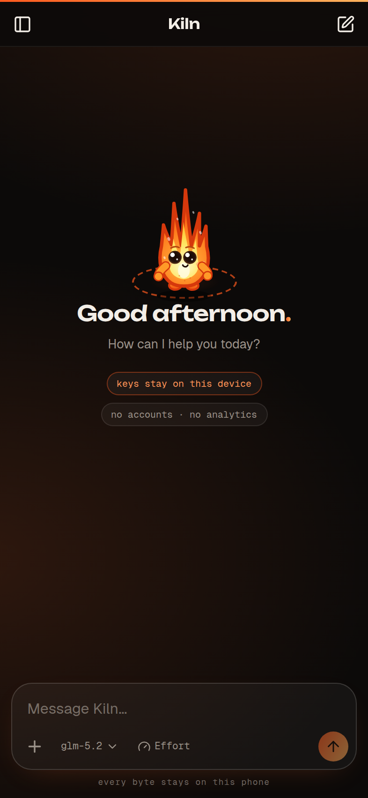 | 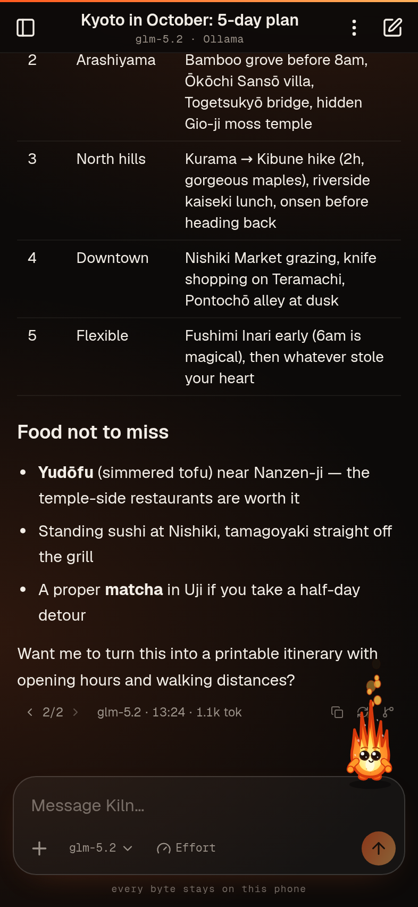 | 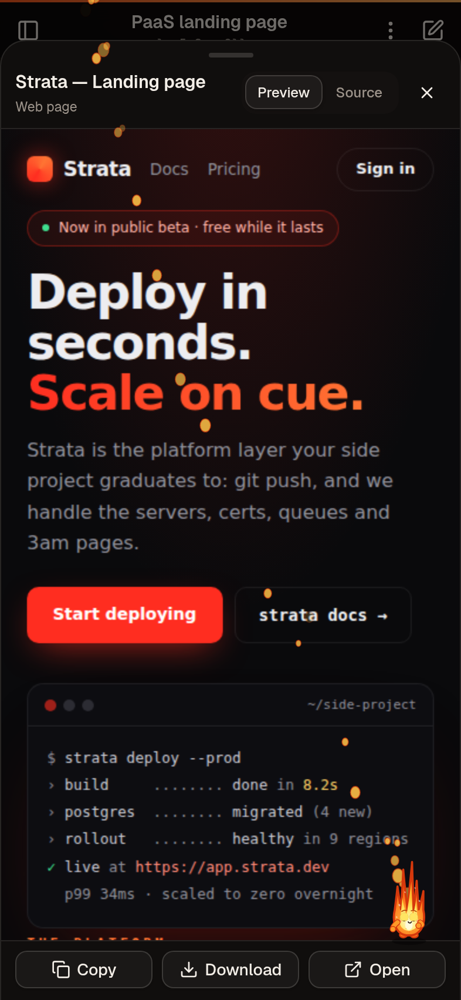 | 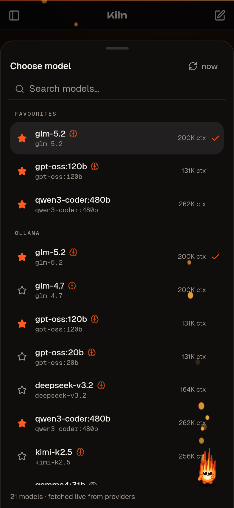 |

**Ember · light**

| New chat | Chat | Artefact viewer | Model picker |
| :---: | :---: | :---: | :---: |
| 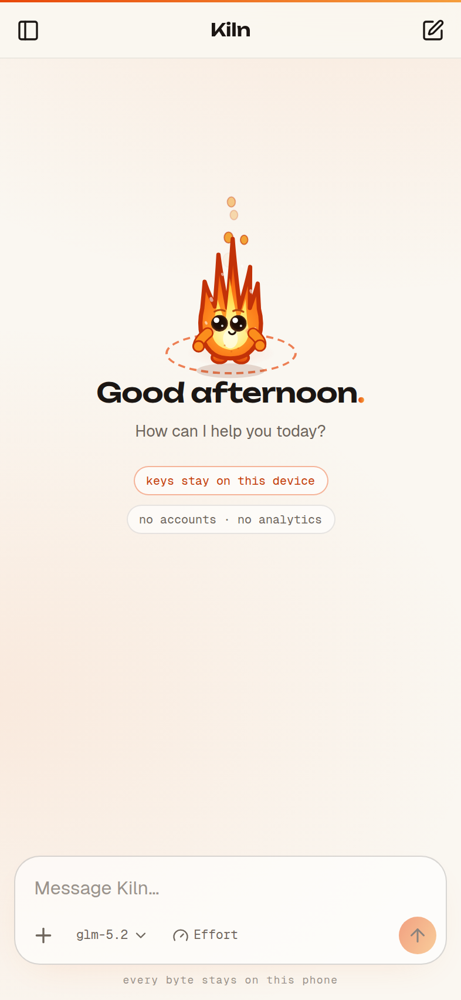 | 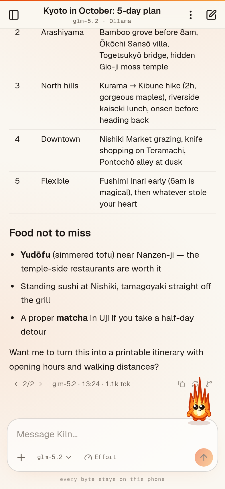 | 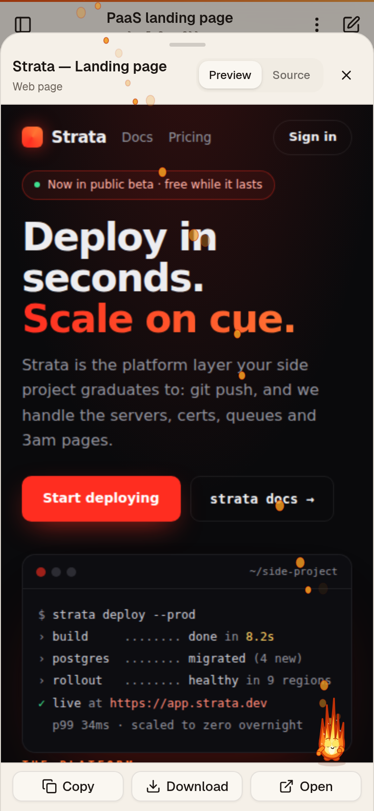 | 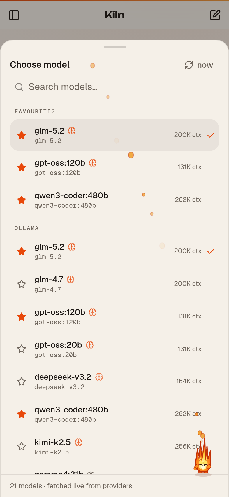 |

**Classic · dark** — the original look, one tap away in Settings → Appearance

| New chat | Chat | Artefact viewer | Model picker |
| :---: | :---: | :---: | :---: |
| 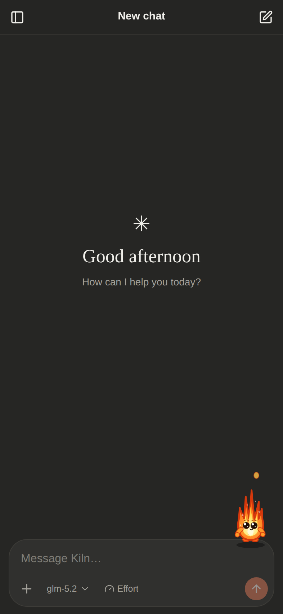 | 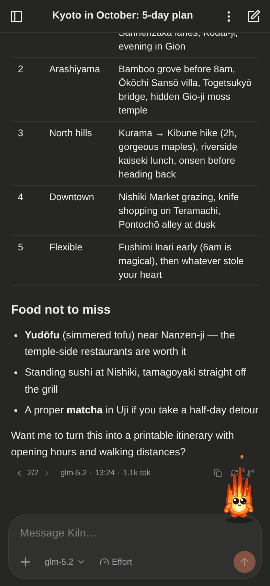 | 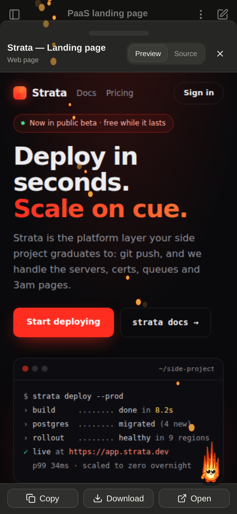 | 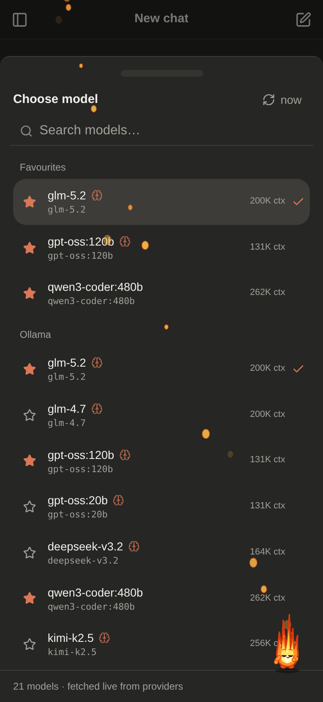 |

**Classic · light**

| New chat | Chat | Artefact viewer | Model picker |
| :---: | :---: | :---: | :---: |
| 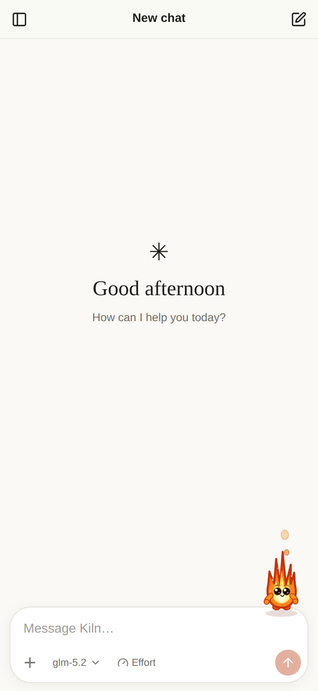 | 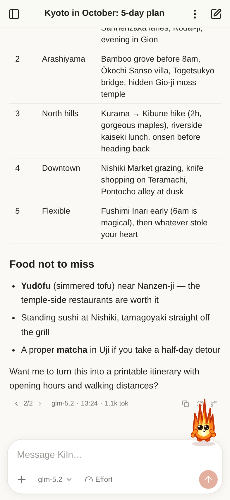 | 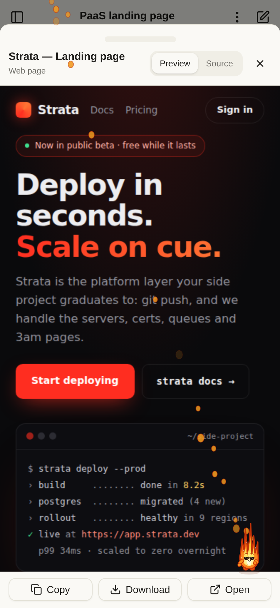 | 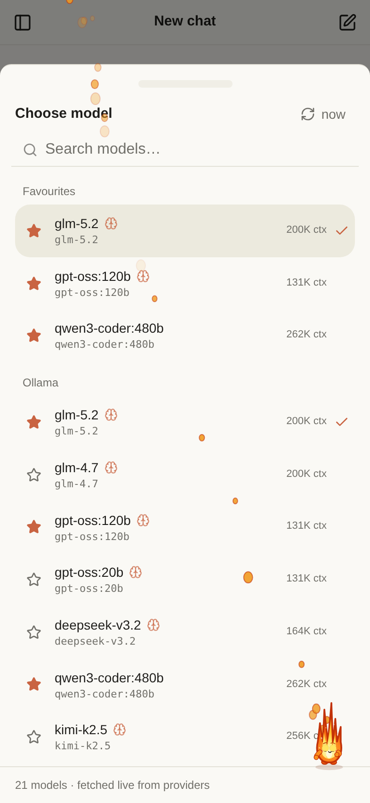 |

## Features

- **Chat & history** — streaming markdown chat with code highlighting, tables,
  chat list grouped by day with the ones you **pin** held at the top, rename,
  delete, export/import (JSON), and
  **full-text search** across every message (with snippets). Opening a hit
  **lands on the message that matched** — it scrolls into the middle of the
  view and flashes — instead of dumping you at the bottom of a long chat.
- **Find in chat** — `/find`, the chat menu, or ⌘/Ctrl+F opens a find bar
  above the composer: every occurrence is highlighted where it sits, ‹ ›
  steps through them and the counter says how many there are. Installed to
  the Home Screen there's no browser find-in-page, so this is it. A
  jump-to-latest button appears whenever you've scrolled back up.
- **Context management** — a chars-based token estimate of every request;
  when a chat nears the model's context limit it is **auto-compacted**
  (older messages summarised by your utility model, newer ones kept
  verbatim). Messages stay visible — a divider marks what's summarised.
  A meter pill appears at 60% usage for one-tap compaction.
- **Slash commands** — type `/` in the composer: `/compact [focus]`,
  `/clear` (fresh context, messages kept), `/find [text]`, `/title`,
  `/model`, `/effort`, `/export [json|md]`, `/stats`, `/pin`, `/help`.
- **Share a chat as Markdown** — the JSON export exists to round-trip back
  into Kiln; this is the version for people. **Copy as Markdown** and
  **Share…** in the chat menu (or `/export md`) produce a readable
  transcript: turns labelled with the model that answered, artefact bodies
  in full, "Searched …" steps, and what each reply cost. Hidden mood tags
  and reasoning traces stay out of it. Available in ghost mode too, where
  it's the only way to keep anything.
- **Usage & cost** — every reply records what the provider actually
  reported, never an estimate: tokens in/out (with cached and reasoning
  splits), the exact credits charged on OpenRouter, and generation speed
  on Ollama. A quiet readout under each reply expands on tap, and
  **Usage & cost** in the chat menu (or `/stats`) totals the whole chat —
  regenerated attempts included, per model.
- **Message editing & versions** — edit any of your messages and resend
  (later messages are replaced after a confirm); **any** reply can be
  regenerated, not just the last — mid-conversation it confirms first, since
  the messages that followed answered the version being replaced. Every
  attempt is kept behind a Claude-style ‹ 1/2 › version switcher, including
  when you switch model between attempts.
- **Branch from a reply** — the non-destructive way out of the same corner:
  copy the conversation up to that reply into a new chat and carry on there,
  leaving the original untouched. Branching a temporary chat gives you
  another temporary chat.
- **Times** — every message shows when it was sent (the full date on hover),
  and a divider marks each new day in a conversation that spans several.
- **Drafts that survive** — an unsent message (with its attachments) stays
  with the chat you were writing it in: leave for another chat and come back,
  reload, or let iOS discard the app in the background, and the words are
  still there. The chat list flags which conversations are holding one.
  Drafts in temporary chats live in memory only, like everything else in
  ghost mode.
- **Artefacts** — the assistant can emit Markdown documents, self-contained
  HTML pages, code files and SVGs as tappable cards with a full-screen
  viewer: rendered preview (sandboxed iframe for HTML/SVG), source view,
  copy / download / open. An **Artefacts** section in the sidebar collects
  every artefact across all chats — searchable, filterable by type, with a
  jump back to the source chat. (The wire tag stays `<artifact>` — US
  spelling is the convention models know.)
- **Interactive questions** — the assistant can end a reply with up to four
  multiple-choice questions (a `<questions>` block, like Claude's question
  chips). They pop up as a sheet with next/back and a review-then-submit
  step (a single question submits directly), always with a free-text
  option. Dismiss the sheet to read the chat and reopen it from the
  question card in the conversation; answers go back as a normal message.
- **Attachments** — capability-aware, driven by each model's provider
  metadata: photos (auto-downscaled) for vision models on **both**
  providers — Ollama takes base64 images natively per its vision API;
  text/code files (inlined) for any model; PDFs for OpenRouter models
  (Ollama's API has no document input). The picker only offers what the
  selected model accepts, and switching to an incompatible model warns
  before sending.
- **Providers** — OpenRouter and Ollama cloud, with live model fetching
  (only for providers whose key you've configured), per-provider grouping,
  search, context length, pricing, and capability badges (vision /
  reasoning / image output). API keys are stored in localStorage on the
  device and go only to the provider. Adding or changing a key refreshes
  the model list immediately.
- **Reasoning effort** — the effort menu shows exactly what each model
  supports, straight from provider metadata: OpenRouter's per-model
  `reasoning.supported_efforts` (e.g. max/xhigh/high/medium/low/none),
  on/off toggles for models where thinking is optional but has no levels,
  and Ollama `think` levels for gpt-oss (on/off for other thinking models).
  Thinking traces show in a collapsible "Thought for Ns" block.
- **Per-message model tracking** — switch model or effort mid-chat; every
  assistant message records the provider/model/effort that produced it.
  The last-used model is remembered for the next chat.
- **Chat titles** — generated by a second LLM call after the first reply;
  choose the title model in Settings (default: same model as the chat).
- **Temporary chats** — ghost mode: kept in memory only, never written to
  disk, with one tap "Save to history" if you change your mind.
- **Skills** — reusable instruction packs (create in Settings, toggle per
  chat from the ＋ menu). Skills marked "on by default" apply to new chats.
- **Personalisation** — name / role / preferences appended to the system
  prompt; the default system prompt is editable and resettable.
- **Built-in tools** — Tavily web search (bring your key) and web fetch
  (reads pages via the CORS-friendly r.jina.ai reader), used agentically by
  tool-capable models, with inline "Searched …" / "Read …" step chips.
- **Image generation** — a separate Images studio optimised for generating
  and browsing pictures with image-output models (e.g. Gemini Flash Image
  on OpenRouter), with full-screen viewing and download. Generated images
  also appear in the Artefacts gallery.
- **Model favourites** — star models in the picker to pin them to a
  Favourites group at the top.
- **Themes & Pip** — two switchable app themes (Settings → Appearance):
  **Ember**, the char-and-ember brand look with Unbounded/Geist type, and
  **Classic**, the original cream & clay. Both come with **Pip the
  stuntflame** — a tiny canvas mascot who perches around the UI, puts on
  turns on the home screen (throwing axes, crossing a high wire with a
  balance pole, juggling embers), strolls the composer ledge, does
  pull-ups under the header, gets clobbered by the opening sidebar and
  jetpacks over to shove it shut. He reacts to the conversation's mood
  too: while he's enabled, replies open with a hidden `<emotion>` tag
  (stripped before display) that he acts on — sighs, drooping brows and
  welling tears for sad news, full streaming tears for heartbreaking
  news, bouncing for exciting news.
  While an artefact streams in he dons a hard hat and plays builder on
  its card, cycling hammer, saw and drill as the job drags on — and past
  30 seconds he jetpacks the card up to the top of the screen and
  parachutes it back down. The same energy goes elsewhere: palette and
  brush while an image is generating (he signs the canvas if it takes
  long enough), a broom and clouds of dust while a chat is being
  compacted, and a dizzy spell or a dead faint when a reply errors out
  (toggle him off in Settings; he respects reduced motion). Themes and
  Pip's tricks are both modular — see `src/lib/themes/` and
  `src/pip/README.md`.
- **PWA** — installable, offline app shell, light/dark (or follow system),
  safe-area aware, iOS keyboard-friendly. Requests **persistent storage**
  so the browser won't evict your chats, shows storage usage in Settings,
  and a crash screen (error boundary) protects against white-screens.
  New versions are detected even when installed to the iOS Home Screen
  (checked on every return to the app and hourly while it stays open),
  prompting with an "Update" toast — plus a manual **Check for updates**
  in Settings → App updates.
- **Notifications** — optional "reply finished" notification + app badge
  when the app is in the background.
- **Resilient streaming** — every chunk is persisted to IndexedDB as it
  arrives; if the OS kills the tab mid-answer you keep everything received
  so far, marked "interrupted", with a one-tap **Continue generating**.
  An optional wake lock keeps the screen on during long generations.
- **Local or Cloud replies** — a composer pill (next to the effort menu)
  chooses where each chat's replies run. **Local** is the default: the
  phone streams from the provider directly. **Cloud** hands the turn to
  your server's runner — provider streaming *and* tool calls happen there,
  so you can close the app mid-reply; reopening catches up (live if it's
  still generating, instantly if it finished) and stores the result on the
  device like any other reply. Stop works from the phone either way. The
  honest cost: while a cloud turn runs, the conversation and the API keys
  it needs sit in the server's memory — never on its disk — and the
  finished reply is deleted from the server the moment the phone collects
  it (or after 24 h). The pill only appears when your deployment has the
  runner; temporary chats never use it.
- **Server hand-off (optional)** — "Send to server" POSTs a chat as JSON to
  a URL you configure, ready for a future sync backend.

## Quick start (Docker)

```bash
docker compose up -d --build
# → http://your-server:8080
```

Or without compose:

```bash
docker build -t kiln .
docker run -d --name kiln -p 8080:8080 --restart unless-stopped kiln
```

### Prebuilt image (GHCR)

CI publishes `ghcr.io/itbm/kiln` on every push to `main`, tagged `latest`
and with the contents of `VERSION` (amd64 + arm64). Pull requests build the
image as a check but never push. `compose.prod.yaml` runs the prebuilt
image (with `pull_policy: always`, so `up -d` picks up new releases):

```bash
docker compose -f compose.prod.yaml up -d
```

Pin a version by editing its `image:` tag, e.g. `ghcr.io/itbm/kiln:0.2.0`.

Then on your phone, open the URL, and:

- **iOS** — Share → **Add to Home Screen**. (Run it over HTTPS — see below.)
- **Android** — Chrome menu → **Install app**.

Open **Settings** in the app and paste your OpenRouter and/or Ollama cloud
API keys (and a Tavily key if you want web search).

### HTTPS

iOS requires a secure context for service workers, notifications and
clipboard. Put Kiln behind your usual reverse proxy (Caddy, Traefik,
nginx-proxy-manager…) with a certificate. Plain `http://localhost` works for
desktop testing only.

### Container hardening & privacy

The compose file runs Kiln as an immutable, minimal-privilege container:

- **Read-only root filesystem** (`read_only: true`) — the only writable path
  is `/tmp`, an in-memory tmpfs holding nginx's pid and temp paths, wiped on
  stop. Nothing can be persisted inside the container, by anyone.
- **Non-root** (`nginx-unprivileged`, uid 101) with **all capabilities
  dropped** and `no-new-privileges`.
- **No access logs** — who chatted and when is never recorded (errors still
  go to stderr for `docker logs`).
- **The Ollama relay never spools chat data to disk** — request and response
  buffering to temp files is disabled in both directions — and it strips
  cookies both ways plus client-identifying headers, so the upstream sees
  only your API key, never a tracking cookie or the phone's address.
- **The cloud turn runner is memory-only** — cloud-mode jobs (conversation,
  keys, the reply being generated) live in the Node process's memory, which
  the read-only filesystem couldn't persist anyway. Keys are dropped the
  moment a turn finishes; the reply is dropped when the phone collects it,
  or after 24 hours. It writes no logs of chat content.

### The Ollama proxy

Ollama cloud doesn't send CORS headers, so browsers can't call it directly —
verified against both hosts (`ollama.com`, `api.ollama.com`) and both API
styles (native `/api/chat`, OpenAI-compatible `/v1/chat/completions`):
every preflight is rejected (405/301 with no `Access-Control-Allow-*`
headers), and authenticated requests always preflight because of the
`Authorization` header. The bundled nginx therefore forwards
`/api/ollama/*` → `https://ollama.com/*` (streaming enabled), and the app's
default Ollama endpoint is `/api/ollama`. Nothing to configure.

The relay is same-origin and path-based — no port is baked in anywhere. The
app calls it relative to whatever URL you're browsing on, so it works
identically on `http://host:8080`, behind a reverse proxy on 443, or any
other published port; nginx is configured to only ever emit relative
redirects so the container's internal port (8080) never leaks into
`Location` headers. You can
also point the endpoint at a LAN Ollama instance
(`http://192.168.x.x:11434`) if you export `OLLAMA_ORIGINS` there.
OpenRouter and Tavily are called directly from the device — in Local mode;
in Cloud mode the runner calls them from the server for that turn.

### The cloud turn runner

The same container runs `server/cloud.mjs`, a dependency-free Node process
on `127.0.0.1:8090`, reached through nginx at `/api/cloud/` (SSE streaming
enabled, cookies stripped, same relative-path posture as the relay). When a
chat is set to **Cloud**, the app POSTs the turn — messages, model, effort,
tool definitions and the keys to run them — as a job; the runner executes
the same provider/tool round loop the app runs locally and journals every
event. The app replays the journal over SSE from the start, whether it
never left or comes back an hour later, then tells the runner to forget
the job. If the runner is down or absent (an older image), the app's
health probe fails quietly and the Local/Cloud pill simply doesn't appear —
chat itself never depends on the runner.

Like the rest of Kiln there's no account system: the runner trusts its
network position, exactly as the Ollama relay does. Jobs are addressed by
unguessable 144-bit ids and are never listable. If your Kiln is on the open
internet, put it behind the auth proxy you already use for the app itself.

## Development

```bash
npm install
npm run dev          # dev server with the same /api/ollama + /api/cloud proxies
npm run cloud        # the cloud turn runner on :8090 (optional; pill hides without it)
npm run build        # type-check + production build into dist/
npm run preview      # serve the production build on :4173
npm run icons        # regenerate PNG icons from public/icons/icon.svg
npm run shots        # screenshot suite (needs `npm run preview` running)
```

Visit `http://localhost:5173/?seed=1` to load demo chats/models so you can
explore the UI without API keys.

## Server hand-off contract

> The Settings UI for this is currently hidden (`SHOW_SERVER_SECTION` in
> `SettingsPage.tsx`) because no backend exists yet — the plumbing below is
> implemented and ready for when one does.

"Send to server" POSTs to `{Server URL}/chats` with
`Authorization: Bearer {token}` (if set) and body:

```jsonc
{
  "app": "kiln",
  "version": 1,
  "exportedAt": 1730000000000,
  "chats": [ { "id": "…", "title": "…", … } ],
  "messages": [ { "id": "…", "chatId": "…", "role": "user", … } ]
}
```

Any small service that accepts that payload works; the same shape is used by
Export/Import, so a future backend can round-trip it.

## Honest limitations

- **Backgrounding on iOS**: Safari suspends network for backgrounded PWAs, so
  a *local* stream can't keep running while you use another app. Kiln
  mitigates rather than pretends: partial output is saved continuously, the
  chat is marked *interrupted*, and **Continue generating** picks the answer
  back up. The optional wake-lock setting avoids the interruption by keeping
  the screen on — and **Cloud** mode sidesteps it entirely, since the reply
  isn't running on the phone at all. What cloud mode can't do is push: with
  the app fully closed you won't get a notification when the reply finishes
  (that needs Web Push, which Kiln doesn't do yet) — it's simply waiting,
  complete, next time you open the app.
- **Notifications on iOS** require the app to be installed to the Home
  Screen (iOS 16.4+), and Apple only reliably shows service-worker
  notifications for pushes; on Android/desktop they work as expected.
- **PDF attachments** are supported on OpenRouter models only — Ollama's
  API accepts images (vision models) but has no document/file input, so
  the app doesn't offer PDFs when an Ollama model is selected.
- Keys live in localStorage: anyone with your unlocked phone and this app
  open can use them. That's the standard trade-off for serverless PWAs.

## Stack

React 19 · TypeScript · Vite 8 · Tailwind CSS 4 · shadcn/ui (Radix) ·
Dexie (IndexedDB) · Zustand · react-markdown + highlight.js ·
vite-plugin-pwa (Workbox) · nginx (Docker)

## License

[Apache License 2.0](LICENSE)
